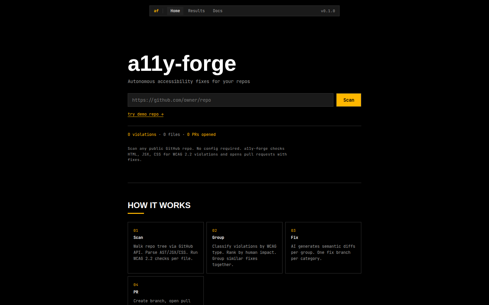
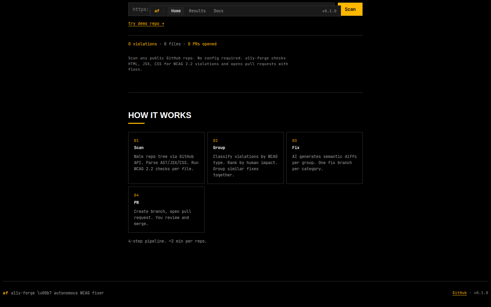
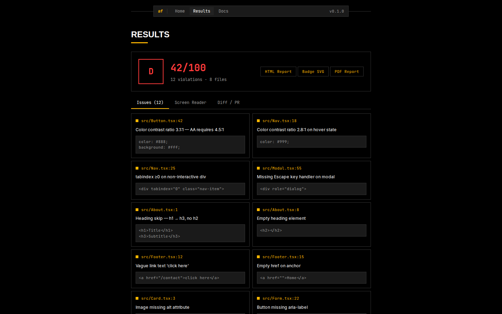
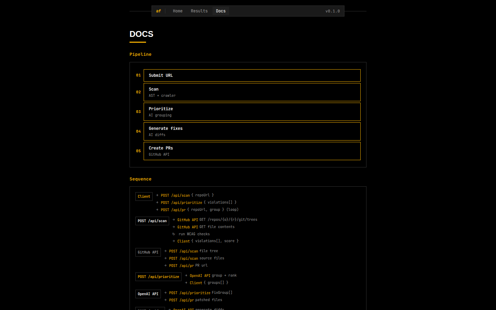

# a11y-forge

> Dark CLI-style accessibility forge. Scan any GitHub repo for WCAG violations, get A+–F score, prioritized fix groups, and reports — in seconds.

<p align="center">
  <a href="https://a11y-forge.vercel.app" target="_blank"><strong>Live Demo</strong></a> ·
  <a href="https://youtu.be/PXrNsw4tF8I" target="_blank"><strong>Demo Video</strong></a> ·
  <a href="#quick-start"><strong>Quick Start</strong></a>
</p>

<p align="center">
  <a href="LICENSE"></a>
  <a href="https://a11y-forge.vercel.app"></a>
  <a href="https://github.com/mahesh-diwan/a11y-forge"></a>
  
</p>

---

## Demo Video

[](https://youtu.be/PXrNsw4tF8I)

_Click image to watch demo (1m54s)_

---

## Screenshots

|                      Home & Scanner                      |                   Pipeline & How It Works                    |
| :------------------------------------------------------: | :----------------------------------------------------------: |
|  |  |

|                          Scan Results                           |                    API Documentation                     |
| :-------------------------------------------------------------: | :------------------------------------------------------: |
|  |  |

---

## Features

- **WCAG 2.2 AA scan** — 12 check types covering contrast, keyboard, headings, ARIA, forms, links, language. Static analysis via AST parsing, regex patterns, and CSS property inspection.
- **AI grouping** — OpenAI model groups violations by category and ranks by user impact. Deterministic fallback when no key is present.
- **Badge generation** — SVG score badge (A+–F) for repo READMEs. POST with score data or GET for default.
- **HTML/PDF reports** — Full scan report with violation details, score breakdown, and affected files.
- **Screen reader preview** — Simulates how violations affect assistive technology output.

---

## Built with Codex + GPT-5.6

Built for OpenAI Build Week 2026. Two AI layers power the project:

**Runtime — GPT-5.6.** `/api/prioritize` calls `gpt-5.6-sol` to group WCAG violations by category and rank by human impact. Raw scan output becomes prioritized fix groups. Deterministic fallback when no key configured.

**Development — Codex CLI + opencode.** Codex CLI (`@openai/codex@0.144.6`) drove the entire build. Paired with opencode (a Codex-powered coding assistant), the AI pair-programming loop handled scaffolding, debugging, testing, and deployment — generating API routes, 12 WCAG check types, responsive UI components, and 165 unit tests through conversational prompts.

**Codex accelerated every phase:**

- API route scaffolds generated from natural-language descriptions in seconds
- 12 WCAG check types implemented via AST parsing, CSS inspection, regex patterns — iterated through AI code review
- Responsive dashboard UI built entirely through prompt-driven development
- Next.js 16.2 CSP crash diagnosed and fixed by analyzing error output together
- Mobile overflow bug surfaced and resolved through automated debugging
- 165 vitest + 3 Playwright e2e tests written and maintained through AI-assisted workflows

**Key AI-assisted decisions:**

- Pipeline architecture (scan → prioritize → fix → report) emerged from AI-guided design exploration
- Deterministic fallback for AI grouping chosen after discussing edge cases with Codex
- Box-sizing reset + overflow-x hidden for mobile viewport — AI flagged the gap
- Error `<p role="alert">` pattern for screen reader compatibility — Codex suggested the pattern

---

## Quick Start

```bash
npm install
cp .env.local.example .env.local   # add keys below
npm run dev                          # http://localhost:3000
```

**Environment variables:**

| Variable         | Required | Purpose                                                                   |
| ---------------- | -------- | ------------------------------------------------------------------------- |
| `GITHUB_TOKEN`   | Yes      | PAT with `repo` scope for tree/commit/PR operations.                      |
| `OPENAI_API_KEY` | No       | Enables AI grouping + fix explanations. Deterministic fallback if absent. |

---

## Pipeline

```
scan → prioritize → fix → report
```

1. **Scan** — Fetches repo tree via GitHub Git Data API, downloads up to 150 source files (HTML/JSX/TSX/Vue/Svelte/CSS), runs 12 check types.
2. **Prioritize** — Groups violations by WCAG category, ranks by severity and user impact. Uses GPT-5.6 when consent is given; deterministic fallback otherwise.
3. **Fix** — Generates minimal diffs, commits to `a11y-fix-<category>` branch, opens PR.
4. **Report** — Emits HTML, PDF, or SVG score badge summarizing results.

---

## Scanner Reference

| Check                   | WCAG Criterion | File Types                  | Approach                                                 |
| ----------------------- | -------------- | --------------------------- | -------------------------------------------------------- |
| Color contrast          | 1.4.3 (AA)     | CSS, JSX, TSX               | CSS property inspection, inline style parse              |
| Keyboard trap           | 2.1.2 (AA)     | HTML, JSX, TSX              | Event handler / tabindex analysis                        |
| Heading hierarchy       | 1.3.1 (AA)     | HTML, JSX, TSX, Vue, Svelte | AST traversal (h1–h6 nesting)                            |
| Link text               | 2.4.4 (AA)     | HTML, JSX, TSX, Vue, Svelte | AST + regex for empty/homogeneous links                  |
| ARIA attributes         | 4.1.2 (AA)     | HTML, JSX, TSX, Vue, Svelte | AST validation of required ARIA props                    |
| Image alt text          | 1.1.1 (AA)     | HTML, JSX, TSX, Vue, Svelte | AST check for missing/empty alt                          |
| Form label              | 1.3.1 (AA)     | HTML, JSX, TSX, Vue, Svelte | AST matching `<label for>` / `aria-label`                |
| Language attribute      | 3.1.1 (AA)     | HTML, JSX, TSX              | Regex + AST for missing `<html lang>`                    |
| Focus order             | 2.4.3 (AA)     | HTML, JSX, TSX, Vue         | Tabindex-positive-value detection                        |
| Non-text content        | 1.1.1 (AA)     | HTML, JSX, TSX, Vue, Svelte | AST for missing alt on `<area>`, `<input type=image>`    |
| Error identification    | 3.3.1 (AA)     | HTML, JSX, TSX              | AST for missing `aria-describedby` / `aria-errormessage` |
| Sensory characteristics | 1.3.3 (AA)     | HTML, JSX, TSX, Vue, Svelte | Regex for direction-only instructions                    |

---

## API

All routes POST unless noted. Rate-limited to 20 req/min per IP (429 + `Retry-After: 60`). Max body 500 KB.

| Route             | Method | Request                                                      | Response                                                         |
| ----------------- | ------ | ------------------------------------------------------------ | ---------------------------------------------------------------- |
| `/api/scan`       | POST   | `{ "repoUrl": string }`                                      | `{ repoUrl, violations[], score, screenReader[], confidence[] }` |
| `/api/prioritize` | POST   | `{ "violations": [], "consentToAi": true }`                  | `{ "groups": [] }` (403 if no consent)                           |
| `/api/pr`         | POST   | `{ "repoUrl", "group": {}, "dryRun"?, "consentToAi": true }` | `{ category, url?, number?, fixCount?, diffs? }`                 |
| `/api/report`     | POST   | `ScanResult`                                                 | `text/html` attachment                                           |
| `/api/report/pdf` | POST   | `ScanResult` (requires `score`)                              | `application/pdf` attachment                                     |
| `/api/badge`      | POST   | `{ "score": {} }`                                            | `image/svg+xml` badge                                            |
| `/api/badge`      | GET    | —                                                            | Default "Not scanned" badge                                      |

**Types** (`src/lib/types.ts`): `Violation { type, file, line, description, snippet? }`, `FixGroup { category, violations[], reasoning }`, `ScoreResult { score, grade, label, color, totalViolations, breakdown[], affectedFiles[] }`, `FixDiff { file, before, after }`, `FixPR { category, url?, number?, fixCount?, diffs? }`.

### Examples

```bash
# Scan a repo
curl -X POST http://localhost:3000/api/scan \
  -H "Content-Type: application/json" \
  -H "Authorization: Bearer $GITHUB_TOKEN" \
  -d '{"repoUrl": "https://github.com/mahesh-diwan/a11y-forge"}'

# Get badge
curl http://localhost:3000/api/badge

# Generate HTML report
curl -X POST http://localhost:3000/api/report \
  -H "Content-Type: application/json" \
  -d '{...scan result...}' -o report.html

# Generate PDF report
curl -X POST http://localhost:3000/api/report/pdf \
  -H "Content-Type: application/json" \
  -d '{...score result...}' -o report.pdf
```

---

## Project Structure

```
src/
├── app/api/
│   ├── scan/route.ts        # repo tree walk + violation detection
│   ├── prioritize/route.ts  # AI grouping + deterministic fallback
│   ├── pr/route.ts          # branch + commit + PR creation
│   ├── report/{route.ts,pdf/route.ts}  # HTML + PDF reports
│   └── badge/route.ts       # SVG badge (POST + GET)
├── components/              # UI components
└── lib/                     # scanner, score, github, openai, fixer, report
```

---

## Scripts

| Script          | Action                            |
| --------------- | --------------------------------- |
| `npm run dev`   | Start dev server (localhost:3000) |
| `npm run build` | Production build                  |
| `npm test`      | Run vitest suite (165+ tests)     |
| `npm run lint`  | ESLint                            |

---

## Tech Stack

Next.js 16.2 (App Router) · TypeScript 5 · Tailwind v4 · Octokit v5 (Git Data API) · OpenAI SDK · @babel/parser (AST) · pdf-lib · mermaid · vitest + playwright.

---

## Security

- **Rate limit** — 20 requests/minute per IP. 429 with `Retry-After: 60`.
- **Consent** — AI endpoints require `consentToAi: true`. Without it, no code is sent to OpenAI (403).
- **Public repos only** — inaccessible/private repos return 403.
- **No private code without opt-in** — source never leaves for model processing unless consent is given.

---

## Contributing

PRs welcome. Open an issue for bugs or feature requests.

1. Fork repo
2. Create branch: `git checkout -b feature/your-feature`
3. Commit changes
4. Push: `git push origin feature/your-feature`
5. Open pull request

---

## License

[MIT](LICENSE) © 2026 Mahesh Diwan
